<p align="center">
  <picture>
    <source media="(prefers-color-scheme: dark)" srcset="docs/assets/readme/banner-dark.svg">
    <source media="(prefers-color-scheme: light)" srcset="docs/assets/readme/banner-light.svg">
    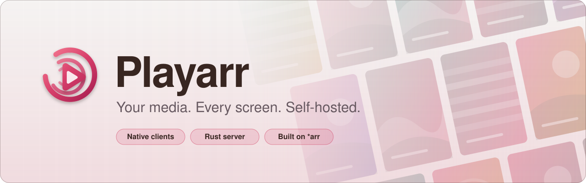
  </picture>
</p>

<p align="center">
  <strong>A self-hosted media server, and the native clients that play it.</strong><br>
  One Rust backend, seven playback clients, and the infrastructure to run it all on anything from a Raspberry Pi to a Kubernetes cluster.
</p>

<p align="center">
  <a href="LICENSE"></a>
  <a href="backend/"></a>
  <a href="https://playarr.app/clients"></a>
</p>

<p align="center">
  <a href="#what-this-is">What this is</a> ·
  <a href="#why-it-exists">Why it exists</a> ·
  <a href="#high-level-architecture">Architecture</a> ·
  <a href="#clients">Clients</a> ·
  <a href="#getting-started">Getting started</a> ·
  <a href="#third-party-media">Third-party media</a>
</p>

<p align="center">
  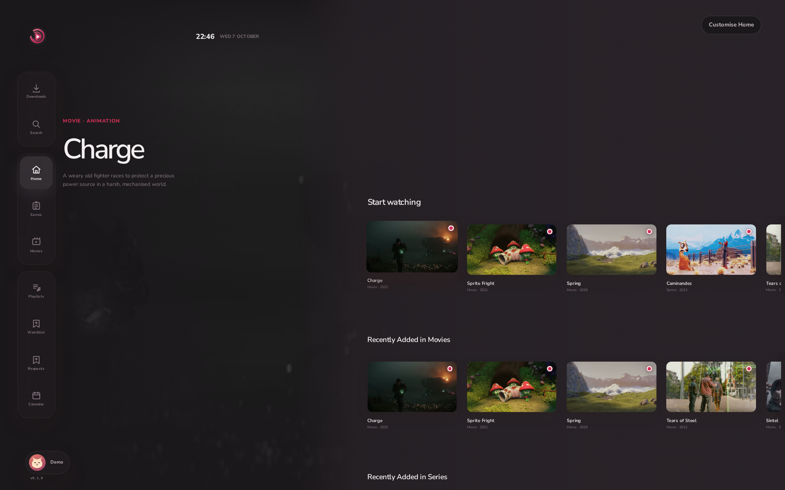
</p>

<table>
<tr>
<td width="50%" align="center">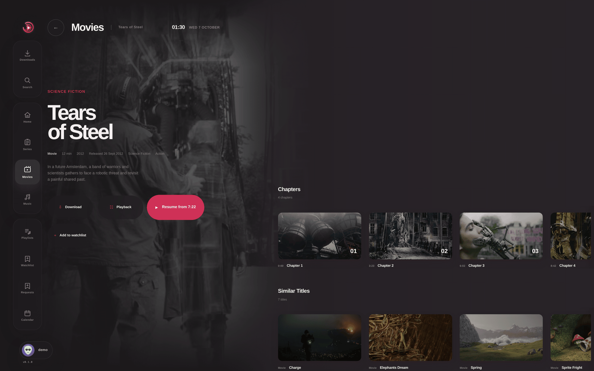<br><sub><b>Movie detail</b><br>Chapters, resume point and similar titles.</sub></td>
<td width="50%" align="center">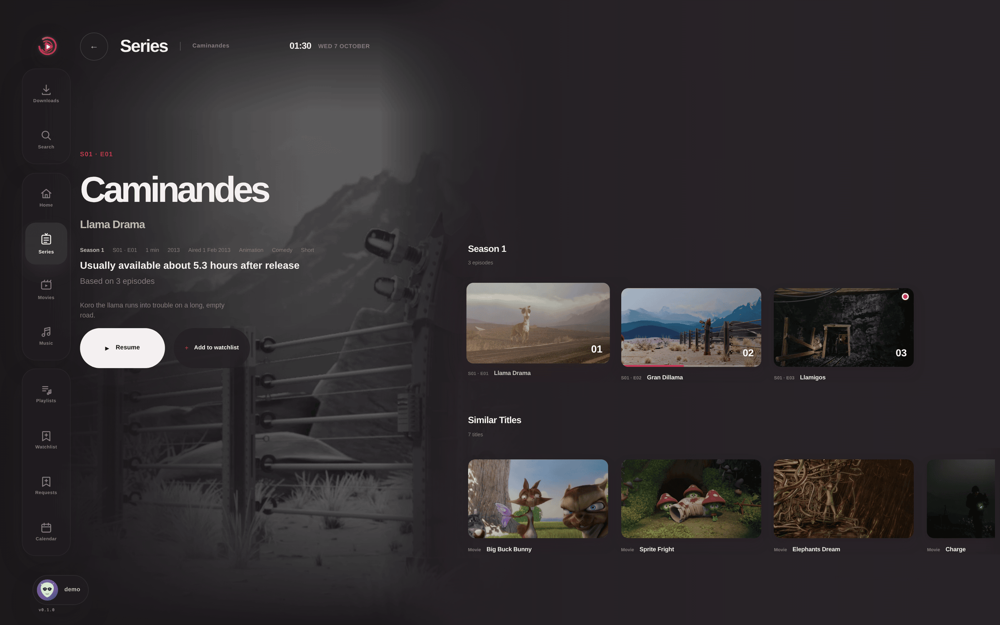<br><sub><b>Series detail</b><br>Seasons, episodes and one-click resume.</sub></td>
</tr>
<tr>
<td width="50%" align="center">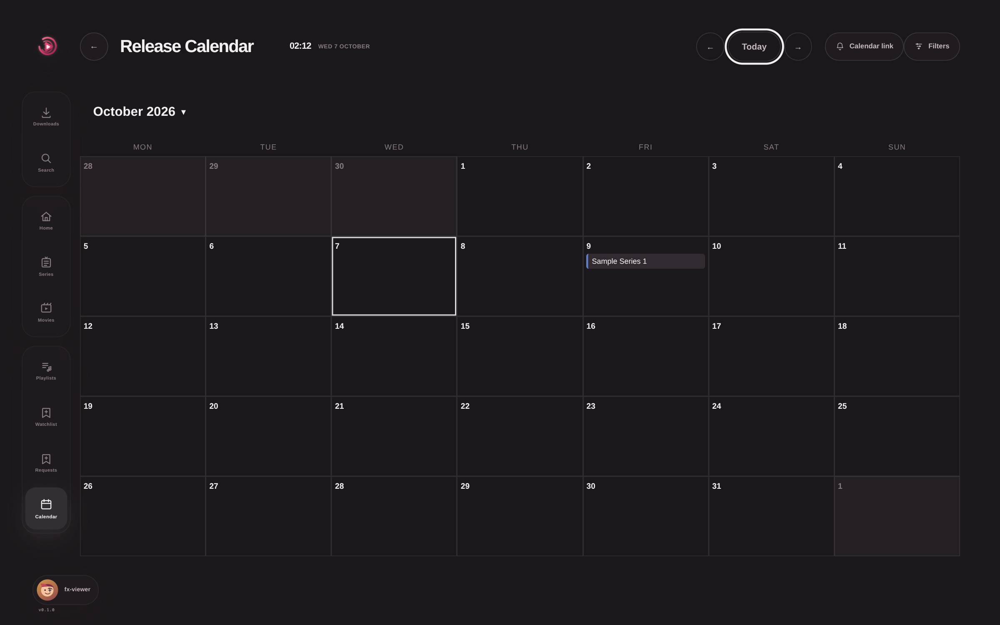<br><sub><b>Calendar</b><br>Upcoming episodes and releases from your source apps.</sub></td>
<td width="50%" align="center">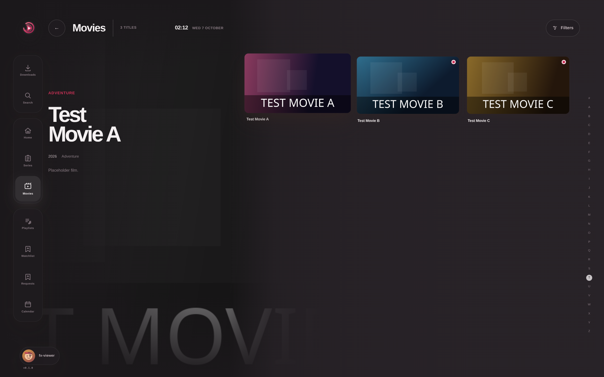<br><sub><b>Movies library</b><br>Artwork grid with an A to Z scrubber and filters.</sub></td>
</tr>
<tr>
<td width="50%" align="center">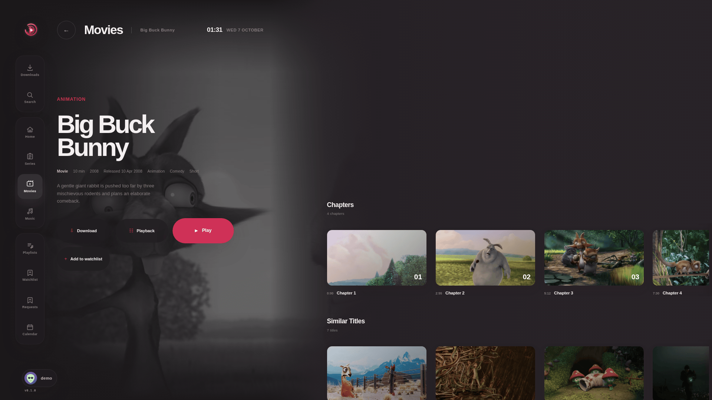<br><sub><b>TV, ten-foot view</b><br>The same detail page laid out for a remote and a sofa.</sub></td>
<td width="50%" align="center">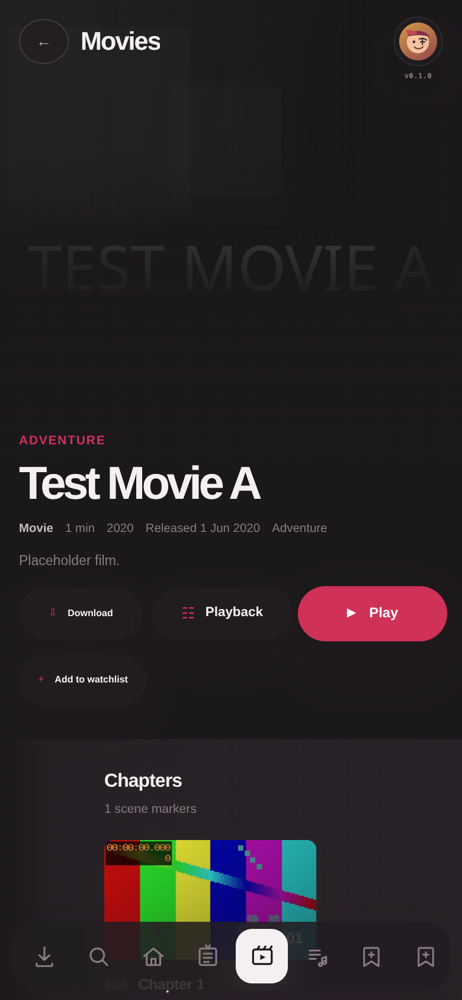<br><sub><b>Mobile</b><br>Responsive layout with a bottom navigation bar.</sub></td>
</tr>
<tr>
<td colspan="2" align="center">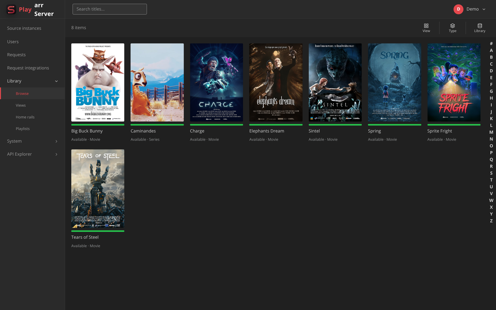<br><sub><b>Server admin</b><br>Library browser in the Playarr Server admin UI.</sub></td>
</tr>
</table>

<p align="center"><sub>The demo library is a placeholder library with generated artwork; no real titles or artwork are shown.</sub></p>

# Playarr Server / Playarr

**Playarr Server** is a self-hosted media server. **Playarr** is the suite of
native clients that watch things on it. This repository is the monorepo for
both: one Rust backend, seven playback clients, and the infrastructure to run
the whole thing on anything from a Raspberry Pi to a Kubernetes cluster.

## Highlights

- **One server, one API.** Library scanning, metadata, artwork, authentication and playback behind a single versioned HTTP/JSON API.
- **Native clients everywhere.** Android Mobile, Android TV, iOS, LG webOS, Samsung Tizen, Hisense VIDAA, Web and Xbox, with full product parity and native-class performance wherever the platform allows.
- **Built on the *arr stack.** Sonarr, Radarr, Lidarr, Bazarr, Prowlarr and Readarr keep doing acquisition; Playarr Server owns the library and the playing.
- **Two kinds of transcoding.** Latency-sensitive transcode-on-play, and library-wide background re-encoding through [Tdarr](https://github.com/HaveAGitGat/Tdarr).
- **SQLite everywhere, one codebase.** One server per SQLite database, run under systemd, Docker Compose or Kubernetes; multiple servers cooperate through peer sync.

## What this is

If you already run Sonarr, Radarr, Lidarr, Bazarr, Prowlarr, and/or Readarr,
you have a great acquisition and organisation pipeline but no single, polished
place to *watch* the result, and no first-class native apps for phones,
tablets, or TVs. Playarr Server sits on top of that stack: it owns your media
library (scanning, metadata, artwork), playback (on-demand and background
transcoding, via [Tdarr](https://github.com/HaveAGitGat/Tdarr) for the
library-wide encode work), authentication, and a single unified HTTP/JSON API,
while leaving indexing, acquisition, and subtitle-fetching to the *arr apps
that already do it well. Playarr is what you actually install to watch things:
Android Mobile, Android TV, iOS, LG webOS, Samsung Tizen, Hisense VIDAA, a
browser-based Web client, and a native Xbox client, all speaking the same
versioned API contract.

Playarr Server is SQLite-only: one server process per SQLite database file,
whether it runs as a systemd service on a home server, as a single Docker
Compose container with a data volume, or as a Kubernetes pod with a
persistent volume. Several servers (for example two regions) cooperate
through peer sync, with each node keeping its own database. See
[`docs/architecture/overview.md`](docs/architecture/overview.md) for why it's
built this way.

## Why it exists

Self-hosted media is currently a patchwork: great acquisition tooling (the
*arr apps), a great transcode farm (Tdarr), and then a gap where a coherent,
native, multi-platform *playback* experience should be. Commercial media
servers fill that gap but keep you out of your own stack. Playarr Server/Playarr
exists to close that gap without giving up ownership: wrap the tools you
already trust, add the library/playback/auth layer they don't provide, and
ship **fully native clients with full product parity and native-class
performance** on every screen people actually watch on. Not a single web view
wrapped seven times. Features degrade only where the platform truly cannot
support them (for example offline downloads on some TV runtimes). The binding
policy is
[`docs/architecture/client-principles.md`](docs/architecture/client-principles.md).

## Clients

<p align="center">
  <picture>
    <source media="(prefers-color-scheme: dark)" srcset="docs/assets/readme/platforms-dark.svg">
    <source media="(prefers-color-scheme: light)" srcset="docs/assets/readme/platforms-light.svg">
    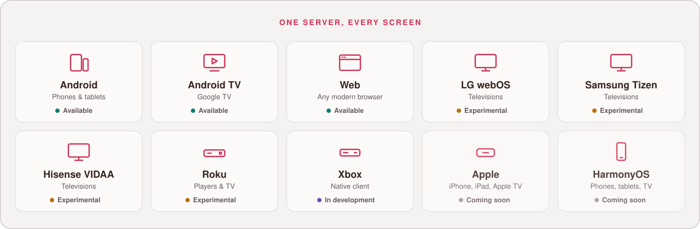
  </picture>
</p>

See the public [Playarr Clients page](https://playarr.app/clients) for current
availability. Hisense owners can follow the [VIDAA guide](docs/clients/vidaa.md)
to open the hosted Playarr Web App in the television Browser or try the
experimental, temporary-DNS launcher installer on compatible firmware. Xbox
owners can follow the [Xbox guide](docs/clients/xbox.md) to use Playarr in
Xbox's built-in Edge browser today, ahead of a native Developer Mode/Store
release.

## High-level architecture

<p align="center">
  <picture>
    <source media="(prefers-color-scheme: dark)" srcset="docs/assets/readme/architecture-dark.svg">
    <source media="(prefers-color-scheme: light)" srcset="docs/assets/readme/architecture-light.svg">
    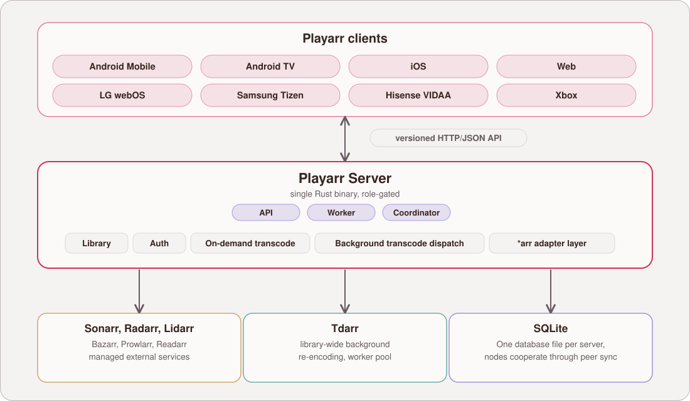
  </picture>
</p>

<details>
<summary>Text version of the diagram</summary>

```
                    ┌───────────────────────────────────────────┐
                    │              Playarr clients               │
                    │  Android Mobile · Android TV · iOS · Web    │
                    │  webOS · Tizen · VIDAA (hosted Web App)     │
                    │  Xbox (native UWP + Edge browser fallback)  │
                    └───────────────────┬─────────────────────────┘
                                        │  versioned HTTP/JSON API
                    ┌───────────────────▼─────────────────────────┐
                    │                 Playarr Server                   │
                    │  (single Rust binary, role-gated: API /     │
                    │   worker)                                   │
                    │                                             │
                    │  library · auth · on-demand transcode ·     │
                    │  background transcode dispatch (Tdarr) ·    │
                    │  *arr adapter layer                         │
                    └───┬───────────────────┬───────────────┬─────┘
                        │                   │               │
                ┌───────▼──────┐   ┌────────▼───────┐   ┌───▼────┐
                │ Sonarr/Radarr │   │      Tdarr      │   │ SQLite │
                │ Lidarr/Bazarr │   │ (worker pool)   │   │        │
                │Prowlarr/Readarr│   │                 │   │        │
                └───────────────┘   └─────────────────┘   └────────┘
```

</details>

Playarr Server treats each *arr application as a managed external service rather
than reimplementing indexing/acquisition/subtitles itself, and splits
transcoding into two independent problems: latency-sensitive on-demand
transcode-on-play, and low-priority library-wide background re-encoding
dispatched to a Tdarr worker pool. The full reasoning, the crate layout, the
deployment options, and the client code-sharing strategy are documented
in depth in [`docs/architecture/overview.md`](docs/architecture/overview.md),
so read that before making non-trivial changes anywhere in the tree.

For what's built, what's next, and how work is sequenced across the monorepo,
see [`docs/roadmap.md`](docs/roadmap.md).

## Getting started

```sh
just --list        # see every available recipe
just backend-check  # fmt + clippy + cargo check for the Rust backend
just backend-test    # backend test suite
just backend-run      # run the Playarr Server locally
just tv-web-dev        # tv-web client dev server
just dev-up              # bring up the local Docker Compose dev stack
just dev-seed              # seed it with sample data
```

See [`CONTRIBUTING.md`](CONTRIBUTING.md) for the full local-development
walkthrough, and [`docs/architecture/overview.md`](docs/architecture/overview.md)
for how the system fits together before you dive into a specific component.

## Repo layout

<details>
<summary>Directory map</summary>

```
.
├── backend/            Playarr Server: the Rust workspace (Cargo workspace under
│                        backend/crates/*, migrations, OpenAPI spec, config,
│                        integration tests). Builds a single `playarr`
│                        binary; see docs/architecture/overview.md for the
│                        role-gating model.
├── clients/             Playarr: the native and web clients.
│   ├── android/                 One native responsive Android project and APK
│   │                            for phones, tablets, Android TV, and Google TV.
│   ├── ios/                    Swift package (SwiftUI app target +
│   │                            UIKit-free PlayarrKit library target).
│   │                            Source-only for now: no Xcode project yet,
│   │                            wraps in one once Xcode is available.
│   ├── tv-web/                   Responsive TypeScript/React Playarr workspace
│   │                              shared by the Web client and the
│   │                              webOS/Tizen/VIDAA TV platform wrappers,
│   │                              plus platform-specific packaging under
│   │                              tv-web/apps/*. Also where Xbox's Edge
│   │                              browser fallback is detected/served from.
│   ├── xbox/                    Native UWP/XAML client: a portable core
│   │                             (Playarr.Core, builds/tests on any OS) plus
│   │                             a UWP application head (Playarr.Xbox,
│   │                             Windows/MSBuild-only, see
│   │                             docs/architecture/clients/xbox.md).
│   └── shared/                     Cross-client tooling, e.g. OpenAPI-
│                                    generated SDK codegen consumed by every
│                                    client above.
├── infra/                Deployment (SQLite, one server per database).
│   ├── systemd/            Unit files for a single-node install.
│   ├── docker/              Docker Compose stacks (dev + prod),
│   │                          plus local observability/mocks for dev.
│   ├── kubernetes/           Base manifests, Helm chart, and
│   │                          per-environment overlays.
│   ├── k6/                    Load-test harness.
│   └── vidaa-gateway/         Expiring DNS and fixed Playarr launcher portal.
├── scripts/               Dev tooling: local environment seeding, SDK
│                           codegen entry points, and related scripts invoked
│                           by the Justfile recipes below.
├── docs/                  Project documentation.
│   ├── architecture/overview.md          Start here.
│   ├── architecture/client-principles.md Native + parity + performance bar.
│   └── roadmap.md                        What's built, what's next.
├── .github/workflows/     CI: per-component workflows plus a top-level
│                           `ci.yml` that fans out to them.
├── Justfile               Cross-language task runner: `just --list`.
├── rust-toolchain.toml    Pins the backend's Rust toolchain.
└── CONTRIBUTING.md        How to build/run each component locally.
```

Every directory above is independently ownable: a crate, an infra directory, a
client platform, or a docs subtree. That's deliberate, see the "Why this is
a monorepo" section of the architecture overview for the reasoning.

</details>

## Documentation

- [`docs/architecture/overview.md`](docs/architecture/overview.md): start here.
- [`docs/architecture/client-principles.md`](docs/architecture/client-principles.md): the native, parity and performance bar.
- [`docs/roadmap.md`](docs/roadmap.md): what's built, what's next.
- [VIDAA guide](docs/clients/vidaa.md) and [Xbox guide](docs/clients/xbox.md).

## Contributing

Read [`CONTRIBUTING.md`](CONTRIBUTING.md) for how to build and run each component locally, and keep pull requests scoped to the component or components they actually touch. Cross-language tasks live in the [`Justfile`](Justfile).

## Security

Please do not report vulnerabilities in public issues. See [`SECURITY.md`](SECURITY.md) for how to report them privately.

## Third-party media

Big Buck Bunny, (c) copyright 2008, Blender Foundation / www.bigbuckbunny.org,
is licensed under [Creative Commons Attribution 3.0](https://creativecommons.org/licenses/by/3.0/)
(see <https://peach.blender.org/about/>). It is not distributed in the app. The
licence does not cover Blender or Big Buck Bunny logos or trademarks, and none are
used. Every screenshot in this repository is taken against a placeholder library
with generated artwork.

## Licence

MIT, see [`LICENSE`](LICENSE).
